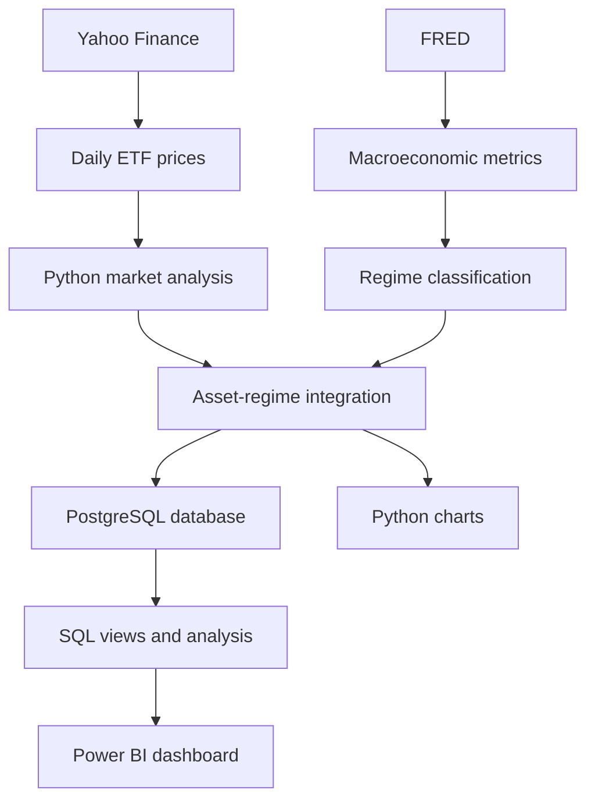
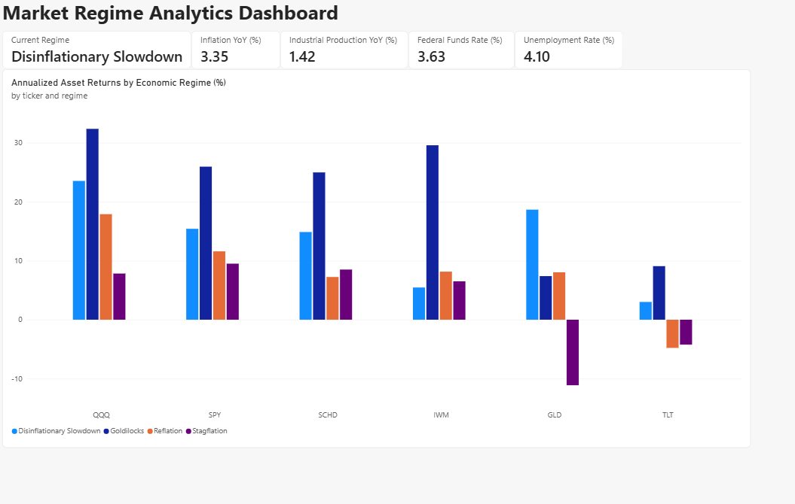
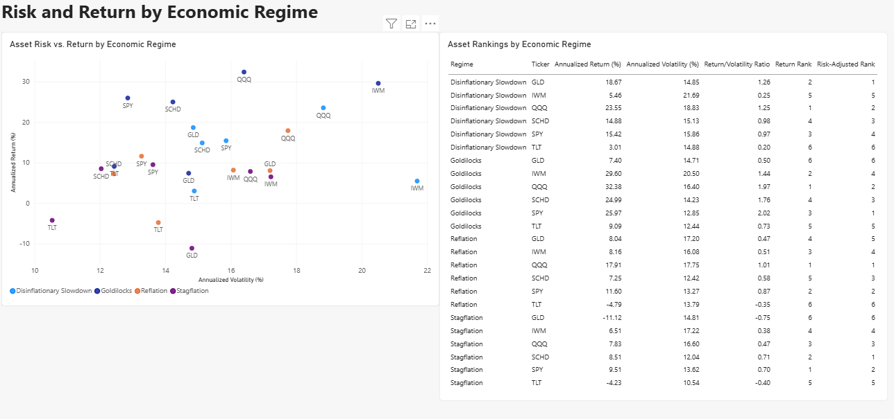

# Market Regime Analytics

An end-to-end financial analytics project examining how asset performance, risk, and diversification change across economic regimes.

## Overview

This project combines daily financial-market data with monthly Federal Reserve economic data to compare six exchange-traded funds across four economic regimes.

The completed analytics pipeline:

* Downloads and validates adjusted ETF prices from Yahoo Finance
* Calculates market return and risk metrics
* Downloads macroeconomic indicators from FRED
* Calculates inflation, growth, interest-rate, and labor-market metrics
* Classifies each month into one of four economic regimes
* Converts daily asset returns into monthly returns
* Merges asset returns with the corresponding economic regimes
* Calculates performance and volatility by asset and regime
* Loads the analytical datasets into PostgreSQL
* Creates reusable SQL views and analytical queries
* Presents the results through a two-page Power BI dashboard
* Generates portfolio-ready Python visualizations

## Project Status

The end-to-end analytics workflow is complete.

| Component                        | Status   |
| -------------------------------- | -------- |
| Market-data extraction           | Complete |
| Return and risk calculations     | Complete |
| FRED macroeconomic extraction    | Complete |
| Economic-regime classification   | Complete |
| Asset and regime integration     | Complete |
| Regime-performance analysis      | Complete |
| Static analytical visualizations | Complete |
| PostgreSQL database              | Complete |
| SQL views and analytical queries | Complete |
| Power BI dashboard               | Complete |

## Business Questions

1. How have major assets performed since 2012?
2. Which assets produced the strongest long-term compound growth?
3. How much volatility accompanied those returns?
4. Which assets experienced the most severe drawdowns?
5. How do asset returns change across inflation and economic-growth regimes?
6. Which assets perform best in each regime?
7. Which assets provide the strongest risk-adjusted performance in each regime?
8. How persistent are economic regimes, and which transitions occur most frequently?
9. Which assets provide the strongest diversification benefits under different economic conditions?

## Assets Analyzed

| Ticker | Exposure                        |
| ------ | ------------------------------- |
| SPY    | US large-cap stocks             |
| QQQ    | US growth and Nasdaq-100 stocks |
| SCHD   | US dividend stocks              |
| IWM    | US small-cap stocks             |
| TLT    | Long-term US Treasury bonds     |
| GLD    | Gold                            |

QQQ is used instead of QQQM because its longer history supports analysis across more economic environments.

## Macroeconomic Indicators

Monthly economic data are downloaded from the Federal Reserve Bank of St. Louis.

| Series                                                  | Indicator                    | Purpose                             |
| ------------------------------------------------------- | ---------------------------- | ----------------------------------- |
| [CPIAUCSL](https://fred.stlouisfed.org/series/CPIAUCSL) | Consumer Price Index         | Measures inflation                  |
| [INDPRO](https://fred.stlouisfed.org/series/INDPRO)     | Industrial Production Index  | Measures economic growth            |
| [FEDFUNDS](https://fred.stlouisfed.org/series/FEDFUNDS) | Effective Federal Funds Rate | Measures monetary-policy conditions |
| [UNRATE](https://fred.stlouisfed.org/series/UNRATE)     | Unemployment Rate            | Measures labor-market conditions    |

The FRED dataset begins in January 2010 to provide enough lookback history for the market-analysis period beginning in January 2012.

## Data Coverage

| Dataset                       | Coverage                           |       Observations |
| ----------------------------- | ---------------------------------- | -----------------: |
| Daily market prices           | January 3, 2012–September 18, 2026 |             22,194 |
| Raw FRED observations         | January 2010–August 2026           |                798 |
| Monthly macroeconomic dataset | January 2010–August 2026           |                200 |
| Classified analysis period    | January 2012–August 2026           |         174 months |
| Asset-regime dataset          | January 2012–August 2026           | 1,044 asset-months |
| Regime-performance summary    | Six assets across four regimes     |            24 rows |

## Technology Stack

* Python
* pandas
* NumPy
* yfinance
* pandas-datareader
* Matplotlib
* Seaborn
* SQLAlchemy
* psycopg
* python-dotenv
* PostgreSQL
* SQL
* Power BI
* Git and GitHub
* Yahoo Finance market data
* FRED economic data

## Data Pipeline



Downloaded and generated CSV datasets are excluded from Git because they can be reproduced by running the project scripts.

## Market Metrics

The market pipeline calculates:

* Daily returns
* Growth of an initial $1 investment
* Rolling 21-day annualized volatility
* Rolling 252-day return
* Compound annual growth rate
* Full-period annualized volatility
* Maximum drawdown

## Macroeconomic Metrics

The macroeconomic pipeline calculates:

* Year-over-year inflation
* Year-over-year industrial-production growth
* Effective federal-funds rate
* Twelve-month federal-funds-rate change
* Unemployment rate
* Twelve-month unemployment-rate change
* Three-month change in year-over-year inflation
* Three-month change in year-over-year industrial-production growth

Rate and unemployment changes are measured in percentage points.

## Regime Classification

Each month is classified using the direction of inflation and industrial-production growth relative to three months earlier.

| Regime                   | Growth Trend | Inflation Trend |
| ------------------------ | ------------ | --------------- |
| Goldilocks               | Accelerating | Decelerating    |
| Reflation                | Accelerating | Accelerating    |
| Stagflation              | Decelerating | Accelerating    |
| Disinflationary Slowdown | Decelerating | Decelerating    |

The federal-funds rate and unemployment rate are retained as contextual variables but are not currently used to determine the regime.

These classifications describe the direction of economic conditions. A Disinflationary Slowdown classification does not necessarily mean the economy is in a recession.

## Regime Distribution

The classified sample covers January 2012 through August 2026.

| Regime                   | Months | Share |
| ------------------------ | -----: | ----: |
| Goldilocks               |     34 | 19.5% |
| Reflation                |     48 | 27.6% |
| Stagflation              |     42 | 24.1% |
| Disinflationary Slowdown |     50 | 28.7% |

A total of 174 out of 176 macroeconomic months received classifications.

## Latest Regime

The latest available classification is for August 2026.

| Metric                                      |                    Value |
| ------------------------------------------- | -----------------------: |
| Year-over-year inflation                    |                    3.35% |
| Three-month inflation trend                 |  -0.81 percentage points |
| Year-over-year industrial-production growth |                    1.42% |
| Three-month growth trend                    |  -0.24 percentage points |
| Federal-funds rate                          |                    3.63% |
| Unemployment rate                           |                    4.10% |
| Regime                                      | Disinflationary Slowdown |

Both inflation and industrial-production growth decelerated relative to three months earlier.

## Full-Period Market Results

Market results cover January 2012 through September 18, 2026.

| Ticker | Total Return | Annualized Volatility | Maximum Drawdown |
| ------ | -----------: | --------------------: | ---------------: |
| QQQ    |    1,335.51% |                20.51% |          -35.12% |
| SPY    |      670.85% |                16.52% |          -33.72% |
| SCHD   |      507.07% |                15.26% |          -33.37% |
| IWM    |      361.90% |                21.13% |          -41.13% |
| GLD    |      157.29% |                16.49% |          -42.11% |
| TLT    |        2.45% |                14.38% |          -48.35% |

### Full-Period Findings

* QQQ generated the strongest compound growth, although it carried more volatility than SPY and SCHD.
* SPY produced substantially stronger returns than IWM despite having lower volatility.
* SCHD delivered lower volatility and a slightly smaller maximum drawdown than SPY.
* Gold produced positive long-term growth but still experienced a drawdown exceeding 40%.
* Long-term Treasury bonds performed poorly over the sample and experienced the most severe maximum drawdown.
* Return alone is insufficient when comparing investments.

## Asset Performance by Regime

Daily asset returns were compounded into monthly returns and joined to the corresponding monthly regime.

The table reports geometric annualized returns across the historical months assigned to each regime.

| Ticker | Goldilocks | Reflation | Stagflation | Disinflationary Slowdown |
| ------ | ---------: | --------: | ----------: | -----------------------: |
| SPY    |     25.97% |    11.60% |       9.51% |                   15.42% |
| QQQ    |     32.38% |    17.91% |       7.83% |                   23.55% |
| SCHD   |     24.99% |     7.25% |       8.51% |                   14.88% |
| IWM    |     29.60% |     8.16% |       6.51% |                    5.46% |
| TLT    |      9.09% |    -4.79% |      -4.23% |                    3.01% |
| GLD    |      7.40% |     8.04% |     -11.12% |                   18.67% |

### Regime Findings

* QQQ generated the highest annualized return during Goldilocks, Reflation, and Disinflationary Slowdown months.
* SPY produced the highest return during Stagflation months and outperformed the other equity funds in that regime.
* Equity returns were strongest during Goldilocks conditions, when growth accelerated while inflation decelerated.
* IWM performed strongly during Goldilocks months but produced only a 5.46% annualized return during Disinflationary Slowdowns.
* TLT produced negative annualized returns during both inflation-accelerating regimes.
* GLD performed best during Disinflationary Slowdowns and produced a negative return during the project’s directional Stagflation regime.
* The results show that directional macroeconomic classifications can produce findings that differ from conventional regime expectations.

These results are descriptive and ex-post. They do not represent a real-time trading strategy.

## PostgreSQL Database

The processed analytical datasets are loaded into a PostgreSQL database named `market_regime_analytics`.

The database uses an `analytics` schema containing three normalized tables.

| Table                                 | Purpose                                                  |  Rows |
| ------------------------------------- | -------------------------------------------------------- | ----: |
| `analytics.assets`                    | Asset reference data                                     |     6 |
| `analytics.macro_regimes`             | Monthly macroeconomic metrics and regime classifications |   200 |
| `analytics.asset_monthly_performance` | Monthly returns and prices for each asset                | 1,044 |

The Python loader performs a transactional full refresh so that related tables are updated together.

### Database Views

Four reusable SQL views support analysis and Power BI reporting:

| View                                      | Purpose                                                                 |
| ----------------------------------------- | ----------------------------------------------------------------------- |
| `analytics.vw_asset_regime_monthly`       | Joins monthly asset performance to macroeconomic regimes                |
| `analytics.vw_latest_macro_conditions`    | Returns the most recent complete macroeconomic conditions               |
| `analytics.vw_regime_performance_summary` | Calculates performance and risk statistics by asset and regime          |
| `analytics.vw_regime_rankings`            | Ranks assets by return and risk-adjusted performance within each regime |

Database credentials are stored in a local `.env` file that is excluded from version control.

## SQL Analysis

The project includes reusable SQL queries demonstrating:

* Multi-table joins
* Common table expressions
* Conditional aggregation
* Window functions
* Return and risk-adjusted rankings
* Best-versus-worst asset comparisons
* Regime-transition analysis
* Consecutive-regime analysis using the gaps-and-islands technique
* Asset performance relative to each asset’s average across regimes

Key SQL files:

* `sql/create_schema.sql`
* `sql/create_views.sql`
* `sql/analysis_queries.sql`

### Highest-Returning Asset by Regime

| Regime                   | Asset | Annualized Return |
| ------------------------ | ----- | ----------------: |
| Goldilocks               | QQQ   |            32.38% |
| Reflation                | QQQ   |            17.91% |
| Stagflation              | SPY   |             9.51% |
| Disinflationary Slowdown | QQQ   |            23.55% |

### Best Risk-Adjusted Asset by Regime

| Regime                   | Asset |
| ------------------------ | ----- |
| Goldilocks               | SPY   |
| Reflation                | QQQ   |
| Stagflation              | SCHD  |
| Disinflationary Slowdown | GLD   |

The risk-adjusted ranking uses the ratio of annualized return to annualized volatility as a descriptive comparison measure.

## Power BI Dashboard

The PostgreSQL analytical views feed a two-page Power BI dashboard.

The dashboard file is stored at:

```text
dashboard/market_regime_dashboard.pbix
```

### Regime Overview

The overview page contains:

* Current economic-regime card
* Inflation, industrial-production growth, federal-funds-rate, and unemployment cards
* Clustered column chart comparing annualized asset returns across regimes



### Risk and Rankings

The second page contains:

* Risk-versus-return scatterplot with ticker labels
* Regime color coding
* Asset return and volatility comparisons
* Return rankings
* Risk-adjusted rankings



## Python Visualizations

### Growth of $1


### Full-Period Risk and Return


### Maximum Drawdown


### Asset Returns by Regime


### Risk and Return by Regime


## Analytical Outputs

### Asset-Regime Monthly Dataset

`data/processed/asset_regime_monthly.csv`

Contains one row per classified asset-month, including:

* Monthly asset return
* Month-end adjusted price
* Economic regime
* Inflation and growth metrics
* Federal-funds rate
* Unemployment rate

The dataset contains 1,044 rows:

```text
174 classified months × 6 assets = 1,044 asset-months
```

### Regime-Performance Summary

`data/processed/regime_performance_summary.csv`

Contains one row per asset and regime, including:

* Number of months
* Average monthly return
* Median monthly return
* Geometric annualized return
* Annualized volatility
* Positive-month percentage
* Best monthly return
* Worst monthly return

The dataset contains 24 rows:

```text
4 regimes × 6 assets = 24 asset-regime summaries
```

## Repository Structure

```text
market-regime-analytics/
├── dashboard/
│   ├── market_regime_dashboard.pbix
│   └── screenshots/
│       ├── growth_of_one.png
│       ├── risk_return_scatter.png
│       ├── maximum_drawdown.png
│       ├── regime_return_heatmap.png
│       ├── regime_risk_return.png
│       ├── powerbi_regime_overview.png
│       └── powerbi_risk_rankings.png
├── data/
│   ├── raw/
│   └── processed/
├── notebooks/
├── reports/
├── sql/
│   ├── create_schema.sql
│   ├── create_views.sql
│   └── analysis_queries.sql
├── src/
│   ├── download_market_data.py
│   ├── calculate_market_metrics.py
│   ├── create_market_charts.py
│   ├── download_fred_data.py
│   ├── calculate_macro_metrics.py
│   ├── classify_market_regimes.py
│   ├── analyze_regime_performance.py
│   ├── create_regime_charts.py
│   └── load_postgres.py
├── .gitignore
├── README.md
└── requirements.txt
```

## Running the Project

Clone the repository:

```bash
git clone https://github.com/JoelTul/market-regime-analytics.git
cd market-regime-analytics
```

Create a virtual environment:

```bash
python -m venv .venv
```

Activate it in Windows PowerShell:

```powershell
.\.venv\Scripts\Activate.ps1
```

Install the dependencies:

```bash
python -m pip install -r requirements.txt
```

### Run the Market-Data Pipeline

```bash
python src/download_market_data.py
python src/calculate_market_metrics.py
python src/create_market_charts.py
```

### Run the Macroeconomic Pipeline

```bash
python src/download_fred_data.py
python src/calculate_macro_metrics.py
python src/classify_market_regimes.py
```

### Run the Integrated Regime Analysis

```bash
python src/analyze_regime_performance.py
python src/create_regime_charts.py
```

### Configure PostgreSQL

Create the project database:

```powershell
psql -U postgres -h localhost -c "CREATE DATABASE market_regime_analytics;"
```

Create a local `.env` file:

```text
POSTGRES_HOST=localhost
POSTGRES_PORT=5432
POSTGRES_DB=market_regime_analytics
POSTGRES_USER=market_analyst
POSTGRES_PASSWORD=replace_with_your_password
```

Never commit the `.env` file or database password.

Create the database schema:

```powershell
psql -U postgres -h localhost -d market_regime_analytics -f sql/create_schema.sql
```

Load the processed data:

```bash
python src/load_postgres.py
```

Create the analytical views:

```powershell
psql -U postgres -h localhost -d market_regime_analytics -f sql/create_views.sql
```

Run the analytical SQL queries:

```powershell
psql -P pager=off -U market_analyst -h localhost -d market_regime_analytics -f sql/analysis_queries.sql
```

### Open the Power BI Dashboard

Open the following file in Power BI Desktop:

```text
dashboard/market_regime_dashboard.pbix
```

The dashboard imports data from the PostgreSQL analytical views. PostgreSQL must be running when refreshing the report.

## Project Roadmap

* [x] Create the GitHub project structure
* [x] Download adjusted ETF price histories
* [x] Add market-data quality validation
* [x] Calculate return and risk metrics
* [x] Generate static market visualizations
* [x] Integrate Federal Reserve economic data
* [x] Calculate inflation, growth, rate, and labor-market metrics
* [x] Classify monthly economic regimes
* [x] Document known source-data gaps
* [x] Merge monthly asset returns with economic regimes
* [x] Analyze asset performance within each regime
* [x] Generate regime-performance visualizations
* [x] Load analytical data into PostgreSQL
* [x] Develop advanced SQL queries and views
* [x] Build a two-page Power BI dashboard
* [x] Document database and dashboard insights
* [ ] Add a one-month-lagged regime robustness analysis

## Data-Quality Notes

* CPI and unemployment observations are unavailable for October 2025 because of the 2025 lapse in federal appropriations.
* Missing source observations are preserved and flagged rather than replaced with invented raw values.
* January 2026 cannot be classified because its three-month inflation comparison depends on October 2025.
* September 2026 market returns are excluded from the regime analysis because macroeconomic data currently end in August 2026.
* FRED observations may be revised after their initial publication.
* Generated CSV files are excluded from version control and can be reproduced from the source scripts.
* Numeric values are rounded before database insertion to maintain compatibility with PostgreSQL and Power BI decimal types.

## Methodology Notes

* Daily adjusted-price returns are compounded into monthly returns.
* Regime-level returns are geometric annualized returns across non-contiguous historical months assigned to each regime.
* Volatility is annualized from monthly return standard deviations.
* All assets use the same classified months, ensuring comparable coverage.
* The current analysis assigns each return to the economic conditions measured during the same month.
* Because economic data are published with a delay, the current classifications are appropriate for historical description rather than real-time portfolio allocation.
* The return-to-volatility ratio is a descriptive comparison and is not a Sharpe ratio because it does not subtract a risk-free rate.
* A one-month-lagged robustness analysis is planned to reduce look-ahead concerns.

## Limitations

* Historical performance does not predict future results.
* Results depend on the selected assets, dates, and regime methodology.
* Regimes are based on changes in inflation and industrial-production growth rather than official recession dates.
* Directional classifications do not necessarily indicate absolute economic strength or weakness.
* Economic data may be revised after their original publication.
* The sample contains only 34 to 50 months per regime.
* The analysis does not currently incorporate taxes, trading costs, or a risk-free benchmark.
* Market data should be treated as research data rather than institutional-grade pricing.
* The results are descriptive and do not constitute investment advice.

## Author

[Joel Tulanowski](https://github.com/JoelTul)
