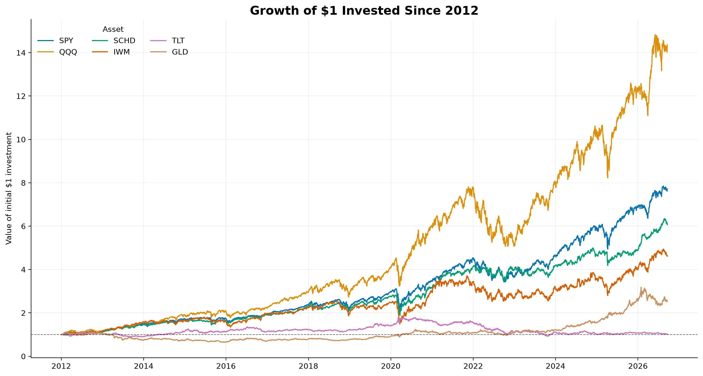
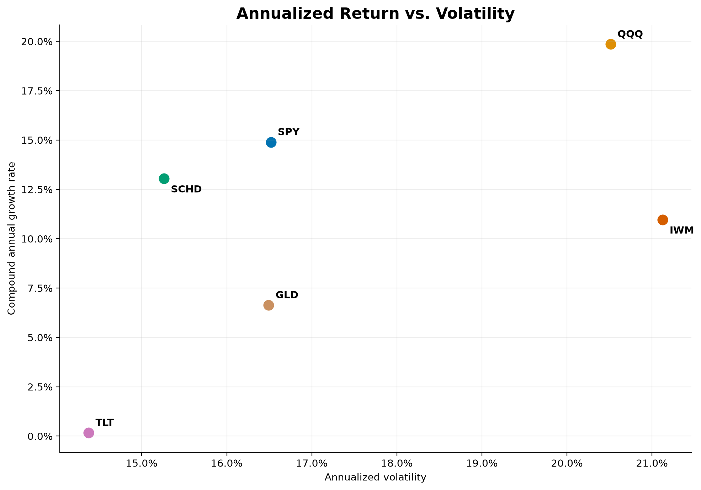
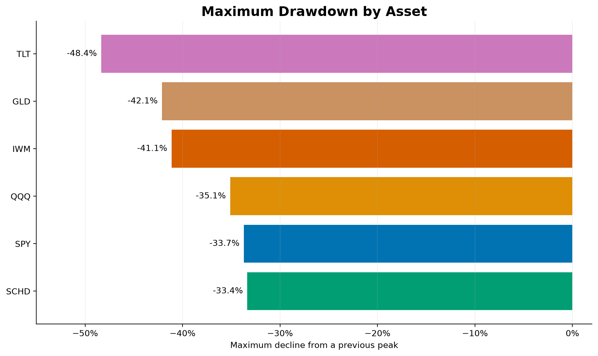

# Market Regime Analytics

An end-to-end financial analytics analytics project examining how asset performance, risk, and diversification change across different economic regimes.

## Overview

This project builds a reproducible Python pipeline that combines financial-market data with Federal Reserve economic data.

The completed completed pipeline currently:

* Downloads adjusted daily ETF prices from from Yahoo Finance
* Validates and transforms the market data
* Calculates return and risk metrics
* Downloads Downloads monthly macroeconomic indicators from FRED
* Calculates inflation, growth growth, interest-rate, and labor-market metrics
* Classifies each month into one of four economic regimes
* Generates portfolio-ready market visualizations

The next phase will merge daily asset returns with the monthly regime classifications and compare asset performance across economic environments.

## Business Questions

1. How have major assets performed since 2012?
2. Which assets produced the strongest long-term compound growth?
3. How much volatility accompanied those returns?
4. Which assets experienced the most severe drawdowns?
5. How do asset returns change across inflation and economic-growth regimes?
6. Which assets perform best in each regime?
7. Which combinations offer the strongest diversification benefits?

## Assets Analyzed

| Ticker | Exposure                        |
| ------ | ------------------------------- |
| SPY    | US large-cap stocks             |
| QQQ    | US growth and Nasdaq-100 stocks |
| SCHD   | US dividend stocks              |
| IWM    | US small-cap stocks             |
| TLT    | Long-term US Treasury bonds     |
| GLD    | Gold                            |

QQQ is used instead of QQQM because its longer history supports analysis across more economic environments.

## Macroeconomic Indicators

Monthly economic data are downloaded from the Federal Reserve Bank of St. Louis.

| Series                                                  | Indicator                    | Purpose                             |
| ------------------------------------------------------- | ---------------------------- | ----------------------------------- |
| [CPIAUCSL](https://fred.stlouisfed.org/series/CPIAUCSL) | Consumer Price Index         | Measures inflation                  |
| [INDPRO](https://fred.stlouisfed.org/series/INDPRO)     | Industrial Production Index  | Measures economic growth            |
| [FEDFUNDS](https://fred.stlouisfed.org/series/FEDFUNDS) | Effective Federal Funds Rate | Measures monetary-policy conditions |
| [UNRATE](https://fred.stlouisfed.org/series/UNRATE)     | Unemployment Rate            | Measures labor-market conditions    |

The FRED dataset begins in January 2010 to provide sufficient lookback history for the market-analysis period beginning in January 2012.

## Technology Stack

* Python
* pandas
* NumPy
* yfinance
* pandas-datareader
* Matplotlib
* Seaborn
* Git and GitHub
* FRED economic data
* PostgreSQL and SQL — planned
* Power BI — planned

## Current Data Pipeline

```text
Yahoo Finance
      |
      v
Daily adjusted ETF prices
      |
      v
Market return and risk metrics
      |
      v
Static market visualizations


FRED
      |
      v
Monthly economic indicators
      |
      v
Macroeconomic metrics
      |
      v
Four-regime classification
```

The next pipeline stage will merge the daily market dataset with the corresponding monthly regime classification.

Downloaded and generated datasets are excluded from Git because they can be reproduced by running the project scripts.

## Market Metrics

The market pipeline calculates:

* Daily returns
* Growth of an initial $1 investment
* Rolling 21-day annualized volatility
* Rolling 252-day return
* Compound annual growth rate
* Full-period annualized volatility
* Maximum drawdown

## Macroeconomic Metrics

The macroeconomic pipeline calculates:

* Year-over-year inflation
* Year-over-year industrial-production growth
* Effective federal-funds rate
* Twelve-month federal-funds-rate change
* Unemployment rate
* Twelve-month unemployment-rate change
* Three-month change in year-over-year inflation
* Three-month change in year-over-year industrial-production growth

Rate and unemployment changes are measured in percentage points.

## Regime Classification

Each month is classified using the direction of inflation and industrial-production growth relative to three months earlier.

| Regime                   | Growth Trend | Inflation Trend |
| ------------------------ | ------------ | --------------- |
| Goldilocks               | Accelerating | Decelerating    |
| Reflation                | Accelerating | Accelerating    |
| Stagflation              | Decelerating | Accelerating    |
| Disinflationary Slowdown | Decelerating | Decelerating    |

The federal-funds rate and unemployment rate are retained as contextual variables but are not currently used to determine the regime.

These classifications describe the direction of economic conditions. A “Disinflationary Slowdown” classification does not necessarily mean the economy is in a recession.

## Regime Distribution

The current regime sample covers January 2012 through August 2026.

| Regime                   | Months | Share |
| ------------------------ | -----: | ----: |
| Goldilocks               |     34 | 19.5% |
| Reflation                |     48 | 27.6% |
| Stagflation              |     42 | 24.1% |
| Disinflationary Slowdown |     50 | 28.7% |

A total of 174 out of 176 months received classifications.

Two months remain unclassified:

* October 2025, because CPI and unemployment observations were unavailable
* January 2026, because its three-month inflation trend depends on the missing October 2025 observation

## Latest Regime

The latest available macroeconomic classification is for August 2026.

| Metric                                      |                    Value |
| ------------------------------------------- | -----------------------: |
| Year-over-year inflation                    |                    3.35% |
| Three-month inflation trend                 |  -0.81 percentage points |
| Year-over-year industrial-production growth |                    1.42% |
| Three-month growth trend                    |  -0.24 percentage points |
| Regime                                      | Disinflationary Slowdown |

Both inflation and industrial-production growth decelerated relative to three months earlier.

## Preliminary Market Results

Market results currently cover January 2012 through September 18, 2026.

| Ticker | Total Return | Annualized Volatility | Maximum Drawdown |
| ------ | -----------: | --------------------: | ---------------: |
| QQQ    |    1,335.51% |                20.51% |          -35.12% |
| SPY    |      670.85% |                16.52% |          -33.72% |
| SCHD   |      507.07% |                15.26% |          -33.37% |
| IWM    |      361.90% |                21.13% |          -41.13% |
| GLD    |      157.29% |                16.49% |          -42.11% |
| TLT    |        2.45% |                14.38% |          -48.35% |

## Initial Market Findings

* QQQ generated the strongest compound growth, although it carried more volatility than SPY and SCHD.
* SPY produced substantially stronger returns than IWM despite having lower volatility.
* SCHD delivered lower volatility and a slightly smaller maximum drawdown than SPY.
* Gold produced positive long-term growth but still experienced a drawdown exceeding 40%.
* Long-term Treasury bonds performed poorly over the full sample and experienced the most severe maximum drawdown.
* These results demonstrate why return alone is insufficient when comparing investments.

Asset performance by regime has not yet been calculated.

## Visualizations

### Growth of $1



### Risk and Return



### Maximum Drawdown



## Repository Structure

```text
market-regime-analytics/
├── dashboard/
│   └── screenshots/
├── data/
│   ├── raw/
│   └── processed/
├── notebooks/
├── reports/
├── sql/
├── src/
│   ├── download_market_data.py
│   ├── calculate_market_metrics.py
│   ├── create_market_charts.py
│   ├── download_fred_data.py
│   ├── calculate_macro_metrics.py
│   └── classify_market_regimes.py
├── .gitignore
├── README.md
└── requirements.txt
```

## Running the Project

Clone the repository:

```bash
git clone https://github.com/JoelTul/market-regime-analytics.git
cd market-regime-analytics
```

Create a virtual environment:

```bash
python -m venv .venv
```

Activate it in Windows PowerShell:

```powershell
.\.venv\Scripts\Activate.ps1
```

Install the dependencies:

```bash
python -m pip install -r requirements.txt
```

Run the market-data pipeline:

```bash
python src/download_market_data.py
python src/calculate_market_metrics.py
python src/create_market_charts.py
```

Run the macroeconomic pipeline:

```bash
python src/download_fred_data.py
python src/calculate_macro_metrics.py
python src/classify_market_regimes.py
```

## Project Roadmap

* [x] Create the GitHub project structure
* [x] Download adjusted ETF price histories
* [x] Add market-data quality validation
* [x] Calculate return and risk metrics
* [x] Generate static market visualizations
* [x] Integrate Federal Reserve economic data
* [x] Calculate inflation, growth, rate, and labor-market metrics
* [x] Classify monthly economic regimes
* [x] Document known source-data gaps
* [ ] Merge daily asset returns with monthly regimes
* [ ] Analyze asset performance within each regime
* [ ] Generate regime-performance visualizations
* [ ] Load analytical data into PostgreSQL
* [ ] Develop advanced SQL queries and views
* [ ] Build an interactive Power BI dashboard
* [ ] Document final investment insights

## Data-Quality Notes

* CPI and unemployment observations are unavailable for October 2025 because of the 2025 lapse in federal appropriations.
* Missing source observations are preserved and flagged rather than replaced with invented raw values.
* January 2026 cannot be classified because its three-month inflation comparison depends on October 2025.
* FRED observations may be revised after their initial publication.
* Generated CSV files are excluded from version control and can be reproduced from the source scripts.

## Limitations

* Historical performance does not predict future results.
* Results depend on the selected assets, dates, and regime methodology.
* Regimes are based on changes in inflation and industrial-production growth rather than official recession dates.
* Directional classifications do not necessarily indicate absolute economic strength or weakness.
* The analysis does not currently incorporate taxes, trading costs, or a risk-free benchmark.
* Market data should be treated as research data rather than institutional-grade pricing.
* Asset performance by regime has not yet been implemented.
* The project is for educational and analytical purposes and does not constitute investment advice.

## Author

[Joel Tulanowski](https://github.com/JoelTul)
